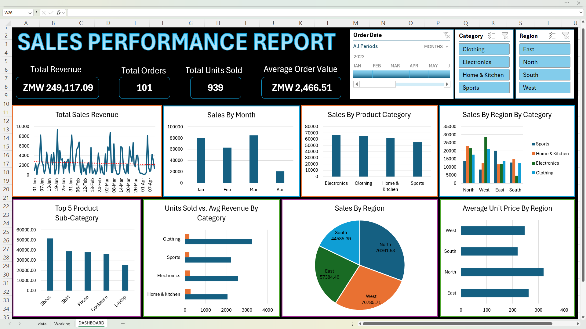

# 📊 Retail Sales Performance Dashboard (Excel)

An interactive sales dashboard built in Excel as part of the School of Statisticians – Kenya mentorship program. This project transforms raw sales data into actionable business insights through dynamic visualizations, allowing users to explore key performance trends, product analytics, regional sales, and order behavior.

---

## 📚 Table of Contents

1. [Overview](#-overview)  
2. [Dashboard Preview](#-dashboard-preview)  
3. [Dataset Summary](#-dataset-summary)  
4. [Data Cleaning](#-data-cleaning)  
5. [Business Questions Answered](#-business-questions-answered)  
6. [Features Implemented](#-features-implemented)  
7. [Key Insights](#-key-insights)  
8. [Recommendations](#-recommendations)  
9. [How to Use](#-how-to-use)  

---

## 📄 Overview

Built during the **School of Statisticians – Kenya** mentorship program, this project focused on turning sales data into meaningful insights through a fully interactive Excel dashboard.

**Key Highlights:**

- Time-series sales performance  
- Product-level insights  
- Regional comparisons  
- Order behavior metrics  
- Real-time interactivity via slicers (region, category, date)

---

## 📸 Dashboard Preview

Here’s a preview of the interactive Excel dashboard:

---

## 📂 Dataset Summary

- **Rows**: 101  
- **Columns**: 10+  

**Key Fields:**

- `Order Date`  
- `Sales`  
- `Quantity`  
- `Product Category` & `Sub-Category`  
- `Region`  
- `Customer Name`  
- `Unit Price`  
- `Order ID`

---

## 🧼 Data Cleaning

To ensure accurate analysis, the following data cleaning steps were applied:

- **Converted to Table Format**: Used Excel Table (Ctrl + T) for better structure and referencing.  
- **Formatted Columns**:
  - Dates as `Date`
  - Sales as `Currency`
  - Quantities as `Number`
- **Duplicate Check**: Verified using *Remove Duplicates*. No duplicates found.  
- **Missing Values**: Checked via filters. No missing data identified.

---

## 🧠 Business Questions Answered

### 🗓 Sales Performance
- What is the total sales revenue over time?  
- Which month or week had the highest sales?

### 🛍 Product Insights
- Which categories drive the most revenue?  
- Top 5 sub-categories by revenue?  
- What are the best-selling products by quantity and revenue?

### 🌍 Regional Analysis
- Which region has the highest contribution to sales?  
- How do product sales vary across regions?

### 📦 Order Metrics
- What is the **Average Order Value (AOV)**?  
- What is the average unit price by category/region?

### 🎛 Dashboard Interactivity
- Users can filter data using slicers for:
  - Region  
  - Product Category  
  - Date Range  

---

## ⚙️ Features Implemented

- Pivot Tables & Pivot Charts  
- Interactive Slicers:
  - Region  
  - Category  
  - Date  
- Timeline for dynamic filtering  
- Calculated Columns:
  - **Revenue** = Quantity × Unit Price  
  - **AOV** = Total Sales ÷ Number of Orders  
- KPI Cards for quick-glance metrics  
- Clean and structured dashboard layout

---

## 💡 Key Insights

- **March** recorded the highest sales: **ZMW 84,817.06**  
- **Electronics** was the top-performing category: **ZMW 66,835.91**  
- **Northern Region** generated the highest overall revenue  
- High sales volume ≠ High revenue (some low-cost products sold more units)  
- Average Order Value (AOV): **ZMW 2,466.51**

---

## ✅ Recommendations

- Launch marketing campaigns before peak months like **March**  
- Expand the **Electronics** category and introduce bundles  
- Prioritize **North Region** for targeted promotions  
- Use **upselling strategies** to increase AOV beyond **ZMW 2,500**

---

## 🧭 How to Use

1. **Download** the Excel file: `Sales_Performance.xlsx`  
2. Open it using **Microsoft Excel 2016** or later  
3. The workbook contains 3 sheets:
   - `data`: Raw dataset (cleaned)  
   - `working`: Pivot tables and calculations (protected)  
   - `DASHBOARD`: Interactive visual report  
4. Use **slicers** to filter by:
   - Region  
   - Product Category  
   - Date Range  
5. **Explore** trends and insights using the pivot charts

👉 Want to use the dataset?
👉 [Download the dataset](./retail_dashboard_data.csv)

---
